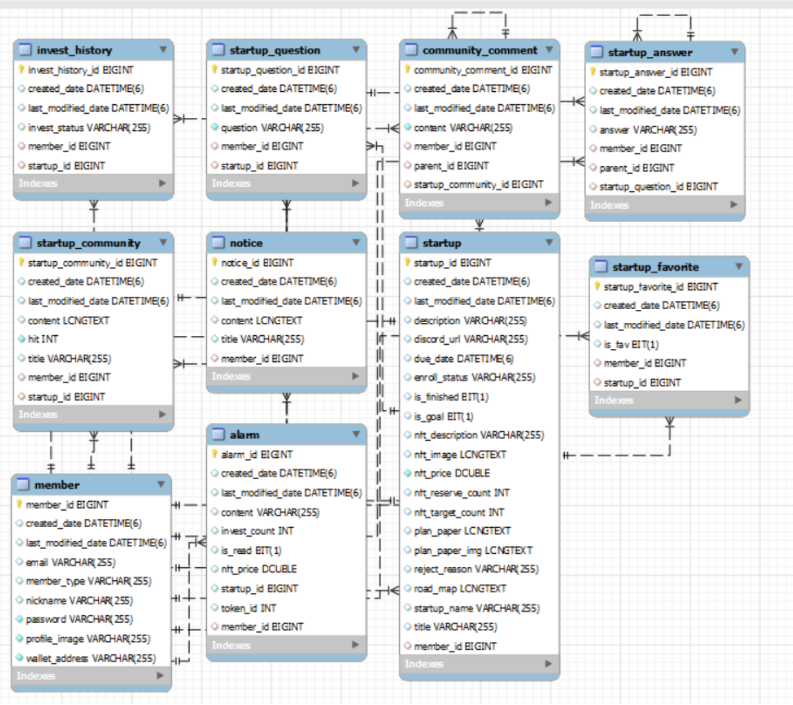

# Uniq.on

- NFT 구매를 통한 소액 투자 서비스

- 주요 기능

  - Metamask 지갑 연결 후 로그인
  - NFT 예약 생성
  - NFT 예약 구매
  - 알림
  - NFT 관리
  - 커뮤니티

## :family: 팀 소개

|                                                한승재                                                |                                                전한울                                                |                                                박상태                                                 |                                                신은정                                                |                                               안호진                                               |                                                이승호                                                 |
| :--------------------------------------------------------------------------------------------------: | :--------------------------------------------------------------------------------------------------: | :---------------------------------------------------------------------------------------------------: | :--------------------------------------------------------------------------------------------------: | :------------------------------------------------------------------------------------------------: | :---------------------------------------------------------------------------------------------------: |
|  |  |  |  |  |  |

 

## 🏗️ 기술스택/아키텍처

 

## 🗃️ ERD

 

## 구현 기능 화면

1. 메타마스크 연결 후 회원가입

   

2. 메타마스크 연결 후 로그인

   

3. 투자 등록 - 렌딩 페이지 투자 신청(스타트업)

   .gif>)

4. 메인리스트 렌딩 페이지 투자 하기(스타트업 투자 리스트)

   .gif>)

5. 투자리스트 상세화면

   1. 즐겨찾기 등록/해제

      

   2. 투자 예약 하기(by 투자자)

      .gif>)

6. 알람

   - 성공시

   1. 민팅하라는 알람을 통해 민팅(스타트업)

      .gif>)

   2. NFT토큰 구매하라는 알람을 통해 토큰 구매(투자자)

      .gif>)

   - 실패시

   1. 투자/예약 실패했다는 알람 읽기(스타트업, 투자자)

      .gif>)

7. 프로필

   1. 내 보유 NFT토큰 목록

      

   2. 관심목록

      

   3. 투자 예약 목록(투자자 입장)

      .gif>)

   4. 투자 등록 목록(스타트업 입장)

      .gif>)

8. 커뮤니티

   1. 보유 NFT 토큰 커뮤니티 입장

      
